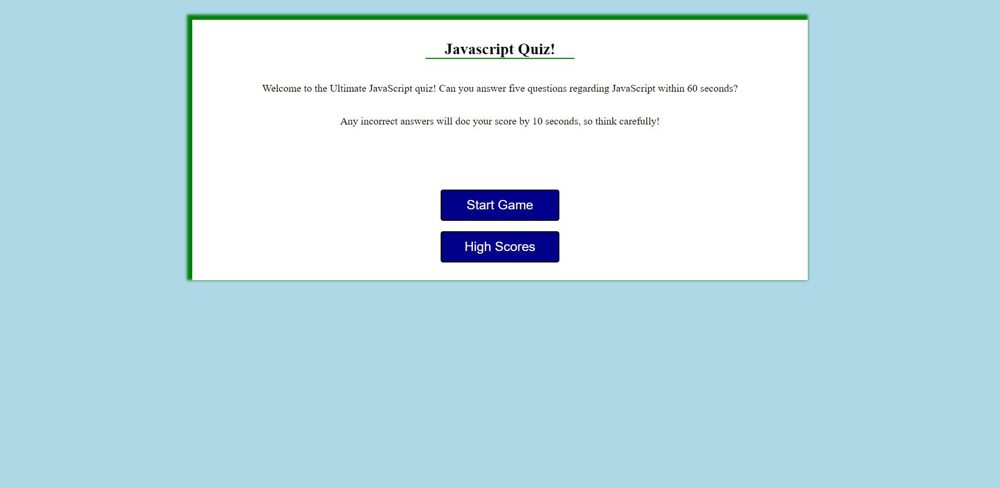

# JavaScript Quiz

## Table of Contents
- [License](#license)
- [Project Overview](#project-overview)
- [Purpose and Inspiration](#purpose-and-inspiration)
- [Technologies](#technologies)
- [Deployment](#Deployment)

## License
This project is licensed under the MIT license.

## Project Overview
This project is a JavaScript quiz that keeps track of the users score in local storage and compares it to the high scores saved in the application. The user has 60 seconds to answer 5 question about the JavaScript language, and each wrong question will dock the user 10 seconds. After the game is over and if they scored high enough, they will be asked to add their name to the high scores list (stored in local storage). 

## Purpose and Inspiration
The purpose of this project was to challenge myself and see how much HTML I could create without touching the HTML!

## Technologies
JavaScript, HTML, CSS

## Deployment
The following is a link to the GitPages site:
 [JavaScript Quiz Website](https://kenny4297.github.io/JavaScript-Quiz/)